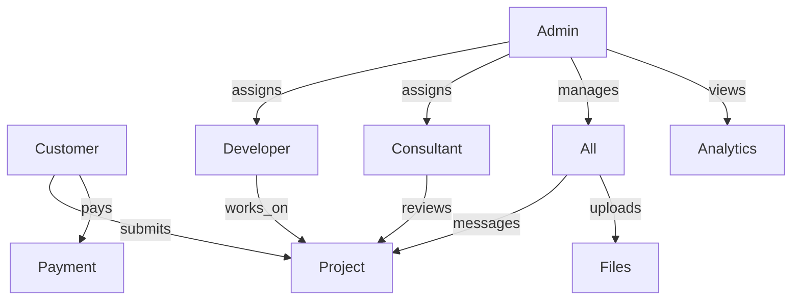

# Freelancer Platform – Feature Matrix

| Feature             | Customer | Developer | Consultant | Admin   |
|---------------------|:--------:|:---------:|:----------:|:-------:|
| Register/Login      | ✅       | ✅        | ✅         | Login   |
| Project CRUD        | Own      | Assigned  | Assigned   | All     |
| Assign Projects     |          |           |           | ✅      |
| Milestones          | View     | Update    | CRUD       | CRUD    |
| Payments            | Own      | View      | View       | All     |
| Files/Docs          | Own      | Assigned  | Assigned   | All     |
| Messaging           | Project  | Project   | Project    | All     |
| Notifications       | In-app   | In-app    | In-app     | In-app  |
| Analytics           |          |           | Assigned   | Full    |
| User Profile        | CRUD     | CRUD      | CRUD       | CRUD    |
| Role Management     |          |           |           | ✅      |
| Project Analytics   |          |           | ✅         | ✅      |

**Legend:** CRUD = Create, Read, Update, Delete; "Own" = their own records only; "Assigned" = only projects assigned to them.

---

**Diagram: System Overview**

